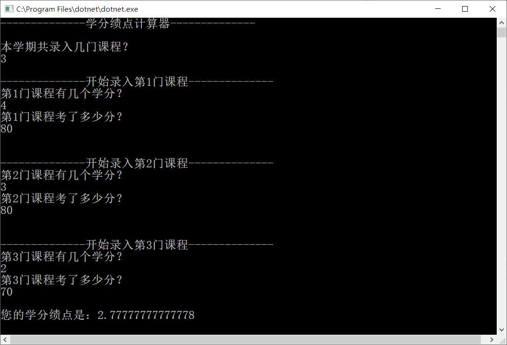

# 学分绩点计算器

学分可以实现录入学生的课程数及相关学分和成绩，从而进行学分绩点计算。

## 1.使用说明
运行程序出现如下界面
按照要求依次输入课程数、每门课程的学分和成绩

## 2.代码

namespace 学分绩点计算器

{
    
    class Program
    {
        static void Main(string[] args)
        {
            Console.WriteLine("--------------学分绩点计算器--------------");
            Console.WriteLine();
            Term thisTerm = new Term();
            int NumOfCourses = GetInput.CourseNum();//本学期课程数

            for (int i = 1; i <= NumOfCourses; i++)
            {
                Console.WriteLine();
                Console.WriteLine("--------------开始录入第{0}门课程--------------", i);

                Console.WriteLine("第{0}门课程有几个学分？", i);

                double credit = GetInput.GetCredit();

                Console.WriteLine("第{0}门课程考了多少分？", i);

                double score = GetInput.GetCredit();

                Course OneCourse = new Course(credit, score);

                thisTerm.AddOneCourse(OneCourse);
                Console.WriteLine();
            }

            Console.WriteLine("您的学分绩点是：" + thisTerm.GetFinalJIDIAN());
            Console.Read();
        }
    }

    class GetInput
    {
        public static int CourseNum()
        {
            Console.WriteLine("本学期共录入几门课程？");
            string num = Console.ReadLine();
            int NUM;
            int.TryParse(num, out NUM);
            return NUM;
        }

        public static double GetCredit()
        {
            string credit = Console.ReadLine();
            double CREDIT;
            double.TryParse(credit, out CREDIT);
            return CREDIT;
        }

    }

    class Course//一门课程
    {
        private double credit;

        private double score;

        public double Credit
        {
            get { return credit; }
            set { credit = value; }
        }

        public double Score
        {
            get { return score; }
            set { score = value; }
        }

        public Course(double _credit, double _score)
        {
            credit = _credit;
            score = _score;
        }

        public double GetJIDIAN() 
        {
            double jidian;
            jidian = ((score - 60) / 10) + 1;
            return jidian;
        }
    }

    class Term //计算部分
    {
        List<Course> AllCourse = new List<Course>();

        public void AddOneCourse(Course course)
        {
            AllCourse.Add(course);
        }

        public double GetFinalJIDIAN()
        {
            double totalCredit = 0;

            double JIDIAN = 0;

            foreach (Course oneCourse in AllCourse)
            {
                totalCredit += oneCourse.Credit;
                JIDIAN += oneCourse.GetJIDIAN() * oneCourse.Credit;
            }

            return JIDIAN / totalCredit;
        }
    }
}

## 3.功能预期
计划在现有计算基础上增添多学期的学分绩点统计并实现图表化输出结果。

## 4.作者
电气1703   王晗
U201711717

 
